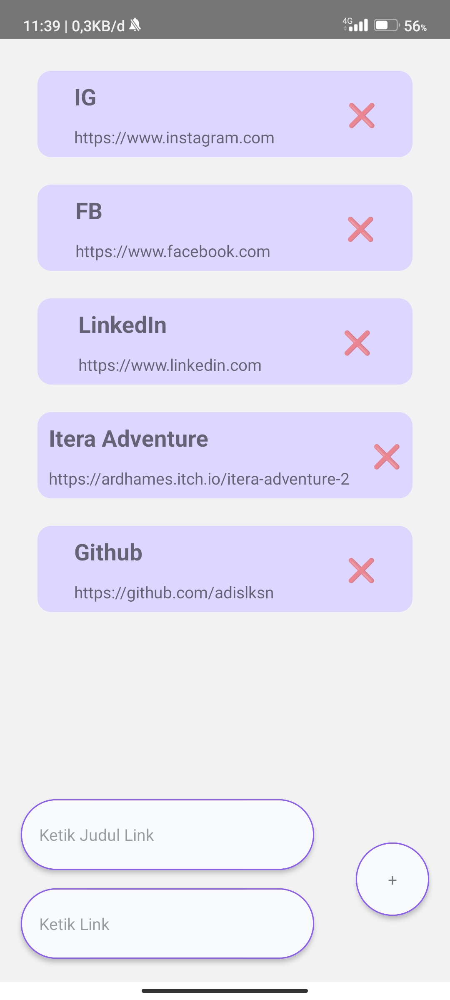

Fast Link
===

## Overview
Apk View
<p align="center">
    
</p>

## Installation
1. Run the following command below in project terminal root to build android apk
```
yarn install
```
or
```
npm install
```
&nbsp;

2. Next is run the same function as git init inside expo
```
npx expo install expo-updates
```
&nbsp;

3. Build inside expo
```
expo build:android
```
or
```
npm install -g eas-cli
eas build -p android
```
&nbsp;

4. Then wait and follow the instruction if it the first build, generate a new key and choose apk.Last if expo need login in terminal input same as your expo.dev account
&nbsp;

## Apk Link
[FastLink-Expo](https://github.com/adislksn/FastLink-Expo/blob/main/FastLink-Expo-cfe54480efc2412fbb5e5d1f73bbee78-signed.apk)